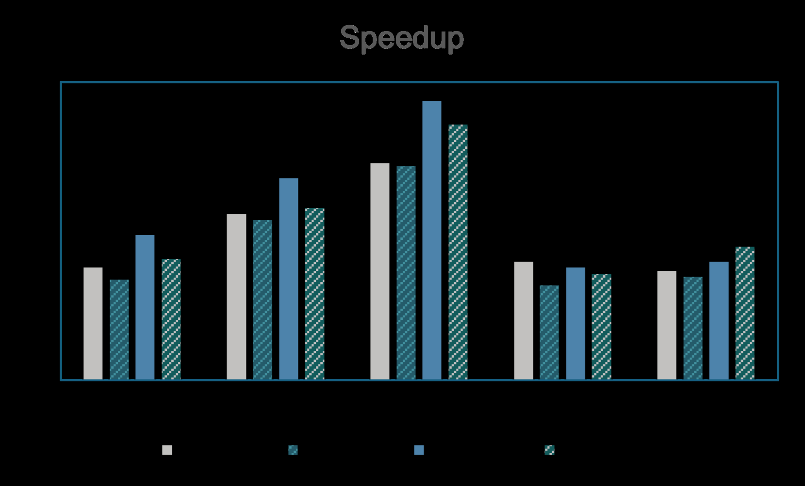
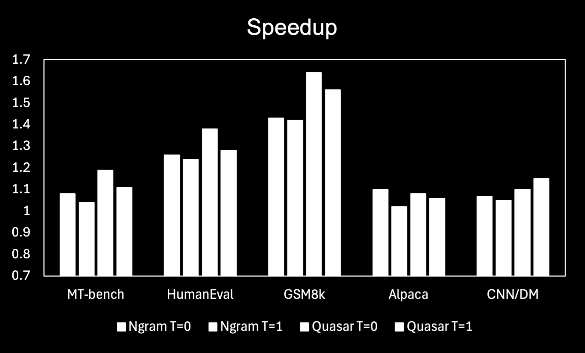
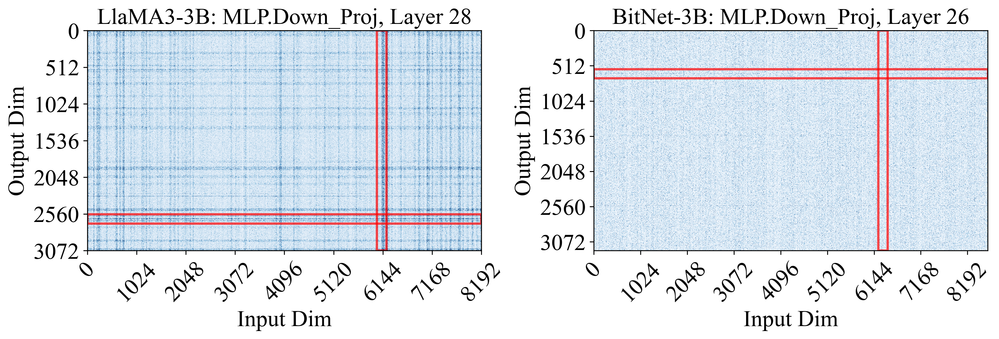
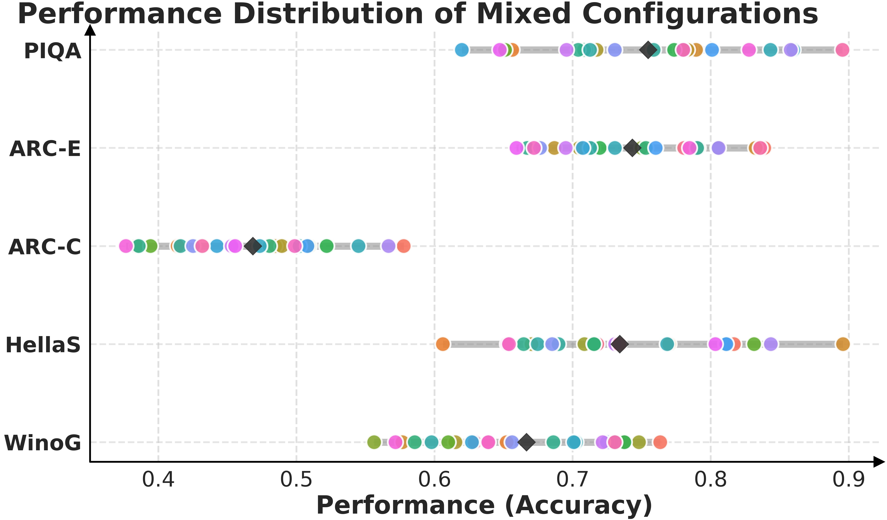
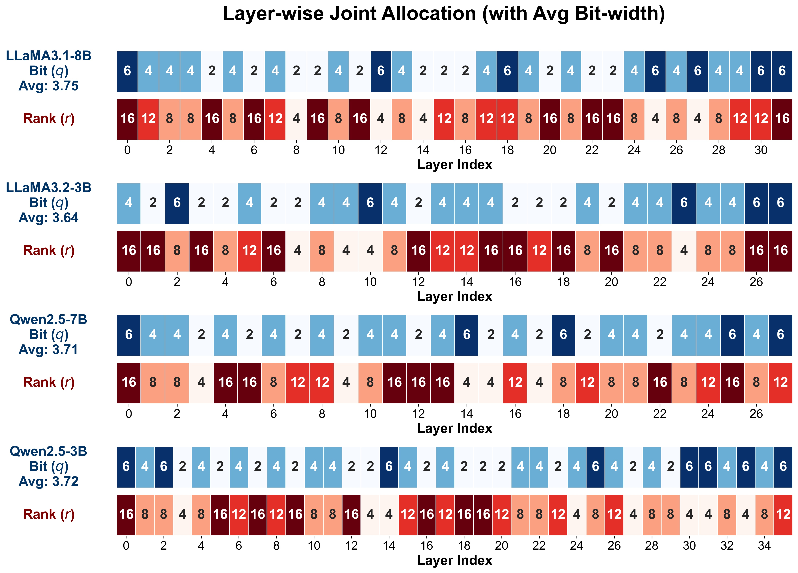

# LLM 量化/部署/低精度/蒸馏文献调研

> 日期：2026-03-03
> 调研论文：4篇 arXiv 最新论文

---

## 目录

1. [Quasar: Quantized Self-Speculative Acceleration](#1-quasar-quantized-self-speculative-acceleration-for-rapid-inference-via-memory-efficient-verification)
2. [InnerQ: Hardware-aware KV Cache Quantization](#2-innerq-hardware-aware-tuning-free-quantization-of-kv-cache-for-large-language-models)
3. [pQuant: Decoupled Linear Quantization-Aware Training](#3-pquant-towards-effective-low-bit-language-models-via-decoupled-linear-quantization-aware-training)
4. [AutoQRA: Joint Optimization of Quantization and LoRA](#4-autoqra-joint-optimization-of-mixed-precision-quantization-and-low-rank-adapters-for-efficient-llm-fine-tuning)

---

## 1. Quasar: Quantized Self-Speculative Acceleration for Rapid Inference via Memory-Efficient Verification

### 论文基本信息

| 项目 | 内容 |
|------|------|
| **arXiv ID** | [2603.01399](https://arxiv.org/abs/2603.01399) |
| **标题** | Quasar: Quantized Self-Speculative Acceleration for Rapid Inference via Memory-Efficient Verification |
| **作者** | Guang Huang, Zeyi Wen |
| **机构** | HKUST(GZ), HKUST |
| **时间** | 2026-03-02 |

### 研究背景

大语言模型（LLM）在推理过程中面临内存带宽瓶颈。Speculative Decoding（投机解码）通过解耦token生成（draft）和验证（verification）来加速推理：
- **Draft阶段**：使用轻量级模型快速预测多个未来token
- **Verification阶段**：使用目标模型并行验证这些token

然而，随着self-speculative decoding和lookahead decoding的发展，drafting阶段的效率已大幅提升，**验证阶段成为了新的性能瓶颈**。验证需要完整的前向传播，模型推理本质上是内存带宽受限的（memory-bound），严重限制了可实现的加速比。

### 研究动机

现有方法的局限性：
1. 验证阶段需要加载完整的FP16权重，内存带宽消耗巨大
2. 随着draft长度增加，验证成本成比例增长
3. 结构化剪枝会显著降低验证精度

核心问题：**如何在保持验证精度的同时，减少验证阶段的内存带宽开销？**

### 技术方案

**Quasar（Quantized Self-speculative Acceleration for Rapid Inference）** 核心思想：
- 对验证阶段使用**低比特量化模型**（如W8A8）
- 保持draft阶段不变，量化仅应用于验证
- 关键洞察：量化的logit分布与全精度分布高度一致

技术细节：
- 采用SmoothQuant风格的W8A8量化
- 无需训练，推理时直接使用量化模型验证
- 与任意draft策略正交

### 实验结果

在OpenPangu和Qwen3等SOTA模型上的实验：

| 指标 | 结果 |
|------|------|
| **端到端吞吐量提升** | **1.28×** |
| **推理加速** | 最高1.6×（GSM8k等推理任务） |
| **Speculative acceptance length** | 与全精度方法相当 |
| **MT-bench** | 一致加速 |
| **HumanEval** | 一致加速 |

### 收益点

1. 🚀 **显著加速验证阶段**：减少内存流量，有效降低带宽压力
2. 🔧 **通用性强**：与任何draft策略正交，可叠加使用
3. ✅ **无损精度**：量化验证保持高保真logit分布
4. 🛠️ **无需训练**：纯推理优化，部署即用

### 局限性

1. 依赖后训练量化（PTQ）技术，量化精度可能随模型规模下降
2. 对硬件有要求：需要支持INT8计算的GPU
3. 最适用于memory-bound场景，compute-bound场景收益有限

### 总结

Quasar通过**量化验证**策略有效解决了self-speculative decoding的验证瓶颈，在保持生成质量的同时实现了1.28×的端到端吞吐量提升。该方法创新性地将量化应用于推理加速，而非传统压缩场景，为LLM部署提供了新的优化方向。

---

## 2. InnerQ: Hardware-aware Tuning-free Quantization of KV Cache for Large Language Models

### 论文基本信息

| 项目 | 内容 |
|------|------|
| **arXiv ID** | [2602.23200](https://arxiv.org/abs/2602.23200) |
| **标题** | InnerQ: Hardware-aware Tuning-free Quantization of KV Cache for Large Language Models |
| **作者** | Mohammadreza Tayaranian Hosseini, Amir Ardakani, Warren J. Gross |
| **机构** | McGill University |
| **时间** | 2026-02-26 |

### 研究背景

LLM推理的decode阶段是内存密集型的，KV Cache的大小随序列长度线性增长，容易成为内存占用的主导因素。传统的后训练量化方法（如GPTQ、AWQ）主要关注权重压缩，而KV Cache作为动态缓存，其量化面临独特挑战：

- KV Cache随token生成不断增长
- 需要在decode阶段频繁访问
- 包含outlier值，量化难度高

### 研究动机

现有KV Cache量化方法的局限性：
1. **分组维度不优**：外维度分组（outer dimension grouping）与向量-矩阵乘法不兼容，导致去量化效率低
2. **Outlier处理**：KIVI等方法用外维度分组避免outlier，但牺牲了效率
3. **精度损失**：为加速而过度压缩导致精度下降

核心问题：**如何在保持精度的同时，最小化KV Cache量化的延迟？**

### 技术方案

**InnerQ** 核心创新：

1. **内维度分组（Inner Dimension Grouping）**
   - 对KV Cache矩阵的内维度进行分组量化
   - 与向量-矩阵乘法对齐，enable scale factor复用
   - 减少内存访问，加速去量化

2. **混合量化（Hybrid Quantization）**
   - 动态选择对称/非对称量化模式
   - 根据每组局部统计信息自适应

3. **高精度窗口（High-precision Windows）**
   - 最近token保持高精度
   - Attention sink token（序列开头）也保持高精度
   - 减少outlier泄漏

4. **Key Cache的Per-channel归一化**
   - 在prefill阶段计算一次
   - 折叠到Query权重，无运行时开销

### 实验结果

在Llama模型上的few-shot GSM8K评估：

| 方法 | 性能 | 延迟改善 |
|------|------|----------|
| **InnerQ** | 与非量化KV Cache相当 | 较Half-precision **88%↓** |
| 较Outer grouping | - | **22%↓** |
| KIVI | 基准 | - |

### 收益点

1. ⚡ **显著降低延迟**：最高88%加速（相比FP16）
2. 🎯 **精度保持**：few-shot GSM8K性能与非量化相当
3. 🔧 **无需调参**：tuning-free方法
4. 📐 **硬件友好**：与GPU计算单元对齐

### 局限性

1. 需要特定硬件支持（NVIDIA GPU最佳）
2. 对超长序列的扩展性待验证
3. 混合量化增加决策开销（但可在memory-bound操作中隐藏）

### 总结

InnerQ通过硬件感知的KV Cache量化方案，在内维度分组、混合量化、高精度窗口等技术创新下，实现了延迟与精度的最佳平衡。该工作证明了量化设计需要与硬件特性协同优化。

---

## 3. pQuant: Towards Effective Low-Bit Language Models via Decoupled Linear Quantization-Aware Training

### 论文基本信息

| 项目 | 内容 |
|------|------|
| **arXiv ID** | [2602.22592](https://arxiv.org/abs/2602.22592) |
| **标题** | pQuant: Towards Effective Low-Bit Language Models via Decoupled Linear Quantization-Aware Training |
| **作者** | Wenzheng Zhang, Bingzheng Liu, Yang Hu, Xiaoying Bai, Wentao Zhang, Bin Cui |
| **机构** | Peking University, Fudan University, Academy of Military Sciences |
| **时间** | 2026-02-26 |

### 研究背景

极低比特（sub-2-bit）量化是LLM压缩的最激进方案，可实现显著的内存和计算节省。但现有方法在**极低比特**场景下仍面临精度严重下降：

- PTQ方法（如PTQ1.61、BiLLM）在1-2bit下精度损失大
- QAT-Scratch（如BitNet）虽然更好，但仍有差距
- 边缘部署场景需要接近FP16的性能

### 研究动机

作者发现了一个关键瓶颈——**参数民主化效应（Parameter Democratization）**：

- 在全精度模型中，少量参数具有极高敏感性
- 在1-bit QAT-Scratch模型中，参数敏感性变得**均匀化**
- 这严重限制了模型的表达能力

核心问题：**如何在极低比特下保持参数敏感性的差异化结构？**

### 技术方案

**pQuant** 核心设计：**解耦线性层**

1. **双分支结构**
   - **主分支（1-bit）**：高效计算
   - **高精度分支**：保护敏感参数

2. **特征缩放引导（Feature Scaling）**
   - 显式引导模型将敏感参数分配到高精度分支
   - 动态学习参数重要性

3. **多专家扩展**
   - 高精度分支扩展为多个稀疏激活的专家
   - 轻量级路由器每token选择一个专家
   - 实现高效容量扩展

### 实验结果

在1.3B模型上与SOTA方法对比（WikiText2 perplexity）：

| 方法 | 比特宽度 | Perplexity |
|------|----------|------------|
| **pQuant (Ours)** | **1.35-bit** | **17.2** |
| BitNet | 1-bit | 21.8 |
| OmniQuant | 2-bit | 42.4 |
| PTQ1.61 | 1.61-bit | 39.6 |
| BiLLM | 1.11-bit | 69.9 |

**收益**：
- Perplexity降低**32%**（相比1-bit SOTA）
- 扩展时超越2-bit模型精度，推理吞吐量提升**18.2%**
- 匹配FP16性能，吞吐量提升**2倍+**

### 收益点

1. 📉 **显著降低Perplexity**：32%改进
2. 📈 **优秀扩展性**：超越2-bit模型
3. ⚡ **高吞吐量**：2倍+提升
4. 🎯 **边缘友好**：适合低资源部署

### 局限性

1. 双分支结构增加实现复杂度
2. 路由器引入额外推理开销（但可控）
3. 目前主要在1-2bit场景验证

### 总结

pQuant通过识别并解决参数民主化问题，创新性地提出解耦线性层结构。该工作为极低比特LLM的训练提供了新范式，证明了在sub-2bit下实现接近FP16性能是可行的。

---

## 4. AutoQRA: Joint Optimization of Mixed-Precision Quantization and Low-rank Adapters for Efficient LLM Fine-Tuning

### 论文基本信息

| 项目 | 内容 |
|------|------|
| **arXiv ID** | [2602.22268](https://arxiv.org/abs/2602.22268) |
| **标题** | AutoQRA: Joint Optimization of Mixed-Precision Quantization and Low-rank Adapters for Efficient LLM Fine-Tuning |
| **作者** | Changhai Zhou, Shiyang Zhang, Yuhua Zhou, Qian Qiao, Jun Gao, Cheng Jin, Kaizhou Qin, Weizhong Zhang |
| **机构** | Fudan University, Yale University, Zhejiang University |
| **时间** |2026-02-25 |

### 研究背景

量化后进行参数高效微调（PEFT）已成为在有限GPU内存下适配LLM的流行范式：
- **QLoRA**：4-bit量化 + LoRA微调
- 优点：大幅降低显存需求
- 应用：下游任务适应

但现有流程存在**关键缺陷**：量化比特分配和LoRA rank分配是**解耦**的！

### 研究动机

作者发现的问题：

1. **联合分配的复杂性**
   - 相同的内存预算下，不同bit-rank组合效果差异巨大
   - 精度差距可达**25%+**（如Winogrande、ARC-Challenge）

2. **静态代理失效**
   - 量化校准指标（如PPL）无法预测微调后性能
   - 相关系数仅**ρ=0.46**

核心问题：**如何联合优化bit-width和LoRA rank？**

### 技术方案

**AutoQRA** 两阶段框架：

**阶段1：全局多保真度进化搜索**
- 初始化：注入layer-wise重要性先验
- 变异：重要性引导的突变（关注重要层）
- 筛选：性能模型辅助筛选候选
- 目标：近似Pareto前沿

**阶段2：局部贝叶斯优化**
- 在Phase I的强候选上做细化
- 使用Trust-region BO
- Expected Improvement (EI) 选择配置
- 主动补偿特定层的量化噪声

### 实验结果

| 指标 | AutoQRA | 对比 |
|------|---------|------|
| **性能** | 接近FP16微调 | - |
| **显存** | 与uniform 4-bit相当 | - |
| **Winogrande** | 显著提升 | 超过25%差距 |
| **ARC-Challenge** | 显著提升 | 超过25%差距 |

### 收益点

1. 🎯 **性能最大化**：接近FP16微调效果
2. 💾 **显存友好**：与4-bit方法相当
3. 🤖 **自动化**：无需人工调参
4. 🔄 **联合优化**：首次实现bit-rank联合搜索

### 局限性

1. 搜索阶段计算开销较大
2. 需要多轮微调评估
3. 主要验证在特定模型和数据集

### 总结

AutoQRA首次系统性地研究了量化比特与LoRA rank的联合优化问题，通过两阶段搜索框架有效解决了静态代理失效问题。该工作为自动化模型压缩提供了新思路。

---

## 总体总结

| 论文 | 核心贡献 | 关键指标 |
|------|----------|----------|
| **Quasar** | 量化验证加速投机解码 | 1.28× 吞吐量 |
| **InnerQ** | 硬件感知KV Cache量化 | 88% 延迟降低 |
| **pQuant** | 解耦QAT解决参数民主化 | 32% PPL降低 |
| **AutoQRA** | 量化+LoRA联合优化 | 接近FP16性能 |

### 技术趋势

1. **量化从推理向训练延伸**：QAT-Scratch、pQuant等
2. **硬件协同设计**：InnerQ的inner grouping、Quasar的验证加速
3. **自动化搜索**：AutoQRA的两阶段优化
4. **细粒度控制**：混合精度、多专家、动态路由

### 值得关注的方向

- 极端低比特（1-bit及以下）的实用化
- 长上下文场景的KV Cache优化
- 量化与Adapter的更深层融合
- 端到端的自动压缩框架
